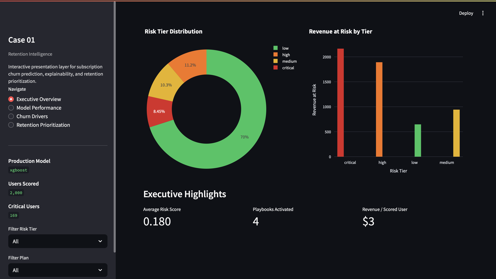
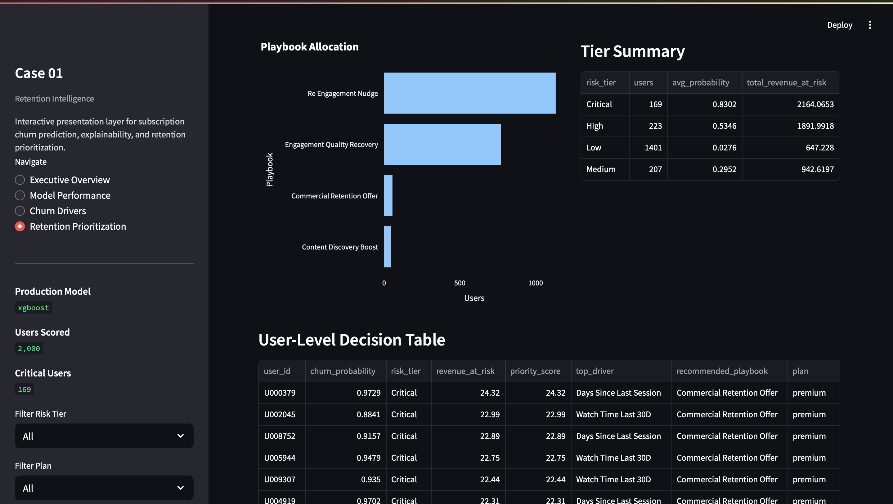
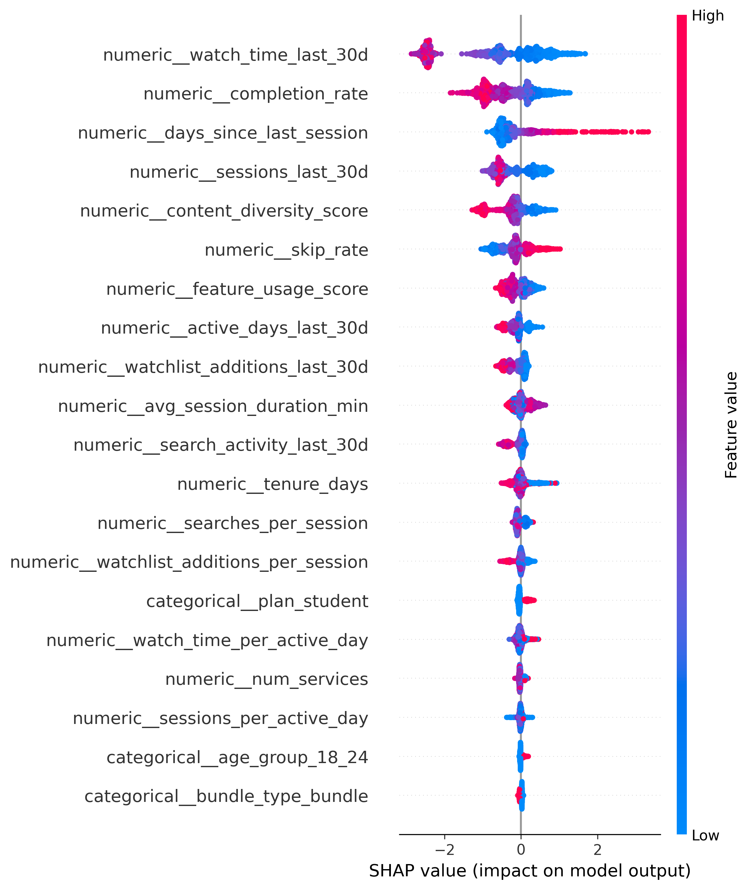

# Retention Intelligence Platform

End-to-end churn prediction and decision intelligence system for subscription businesses.

---

## Key Results

- **0.901 ROC-AUC** (Production XGBoost Model)  
- **169 High-Risk Users Identified**  
- **$5,646 Revenue Exposure Quantified**  
- **SHAP-based behavioral driver analysis**  

---

## Dashboard Preview

  
  

---

## Business Problem

Subscription platforms face continuous revenue leakage due to preventable customer churn.

Traditional analytics approaches focus on **reporting churn after it happens**, rather than enabling **proactive intervention**.

This project addresses that gap by building a **retention intelligence system** capable of:

- predicting churn risk  
- explaining behavioral drivers  
- prioritizing users by economic impact  
- recommending targeted retention actions  

---

## Solution Overview

This platform simulates a production-grade analytics system combining:

- predictive modeling  
- explainable AI  
- decision intelligence  

### Architecture

Simulation → Features → Modeling → Explainability → Decisioning → Dashboard

---

## Model Performance

The system benchmarks multiple models and selects a production champion based on business-aware metrics.

| Model | ROC-AUC | PR-AUC | Lift@10% |
|------|--------|--------|----------|
| Logistic Regression | 0.82 | 0.49 | 2.1x |
| Random Forest | 0.88 | 0.61 | 2.9x |
| **XGBoost (Champion)** | **0.90** | **0.65** | **3.4x** |

### Why XGBoost?

Selected for its superior balance between:

- ranking quality  
- precision-recall performance  
- prioritization efficiency for retention interventions  

---

## Churn Drivers (Explainability)

Key behavioral drivers of churn:

- declining watch time  
- lower completion rate  
- increased inactivity  
- reduced session frequency  
- lower content diversity  

### Insight

Churn is driven primarily by **behavioral disengagement**, not demographic characteristics.

---

## Decision Intelligence Layer

Predictions are operationalized into:

- **Risk Tiers** (Low, Medium, High, Critical)  
- **Revenue at Risk**  
- **Priority Scores**  
- **Retention Playbooks**  

### Example Playbooks

- Re-engagement nudges  
- Content discovery boosts  
- Engagement quality recovery  
- Commercial retention offers  

---

## Business Impact

- Enabled proactive retention intervention strategies  
- Quantified revenue exposure at user level  
- Shifted analytics from descriptive → predictive → prescriptive  
- Operationalized ML outputs into decision-ready insights  

---

## Tech Stack

Python  
pandas / NumPy  
scikit-learn  
XGBoost  
SHAP  
Plotly  
Streamlit  

---

## Repository Structure

retention-intelligence-platform/  
├── app/  
├── assets/  
├── config/  
├── dashboards/  
├── data/  
├── docs/  
├── logs/  
├── models/  
├── notebooks/  
├── reports/  
├── src/  
└── README.md  

---

## Quick Start

### 1. Install dependencies

pip install -r requirements.txt  

### 2. Run pipeline

python -m src.pipeline.run_simulation  
python -m src.pipeline.run_features  
python -m src.pipeline.run_modeling  
python -m src.pipeline.run_explainability  
python -m src.pipeline.run_decisioning  

### 3. Launch dashboard

streamlit run app/dashboard_app.py  

---

## Portfolio Context

This project was developed as part of a **Data Science portfolio targeting Apple Decision Intelligence roles**, demonstrating:

- end-to-end ML system design  
- explainable AI  
- decision intelligence frameworks  
- business-oriented analytics  
- executive storytelling  

---

## Author

**Israel Gómez Millán**  
Actuary & Senior Data Scientist